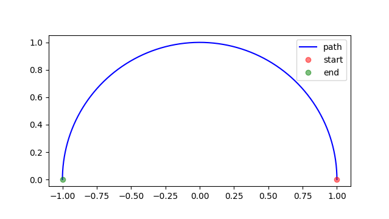
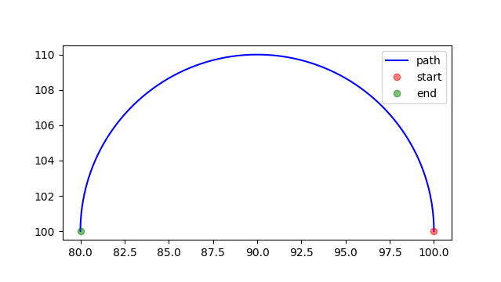

================
arc
================

.. py:currentmodule:: gcodeBuddy.arc

.. automodule:: gcodeBuddy.arc
    :members:

**********
Examples
**********

.. code-block:: python
    :caption: Basic Arc Usage

    # imports Arc object
    from gcodeBuddy import Arc

    # creating upper half of unit circle Arc object
    upper_half_arc = Arc(center=[0, 0],
                   radius=1,
                   start_angle=0,
                   end_angle=180,
                   direction="cc")

    # prints [0, 0]
    print(upper_half_arc.get_center())

    # plots arc in a new pop-up window
    upper_half_arc.plot()

    result of upper_half_arc.plot()

.. code-block:: python
    :caption: Integrated Usage with Marlin G2/G3 Command Objects

    # imports Arc object
    from gcodeBuddy import Arc

    # imports Marlin Command object and function to convert Command Object to Arc object
    from gcodeBuddy.marlin import Command, command_to_arc

    # creating Command Object
    arc_travel_command = Command("G3 X80.0 R10.0")

    # converting Command object to Arc object (with an initial position)
    arc = command_to_arc([100, 100], arc_travel_command)

    # plotting arc object
    arc.plot()

    result of arc.plot()
