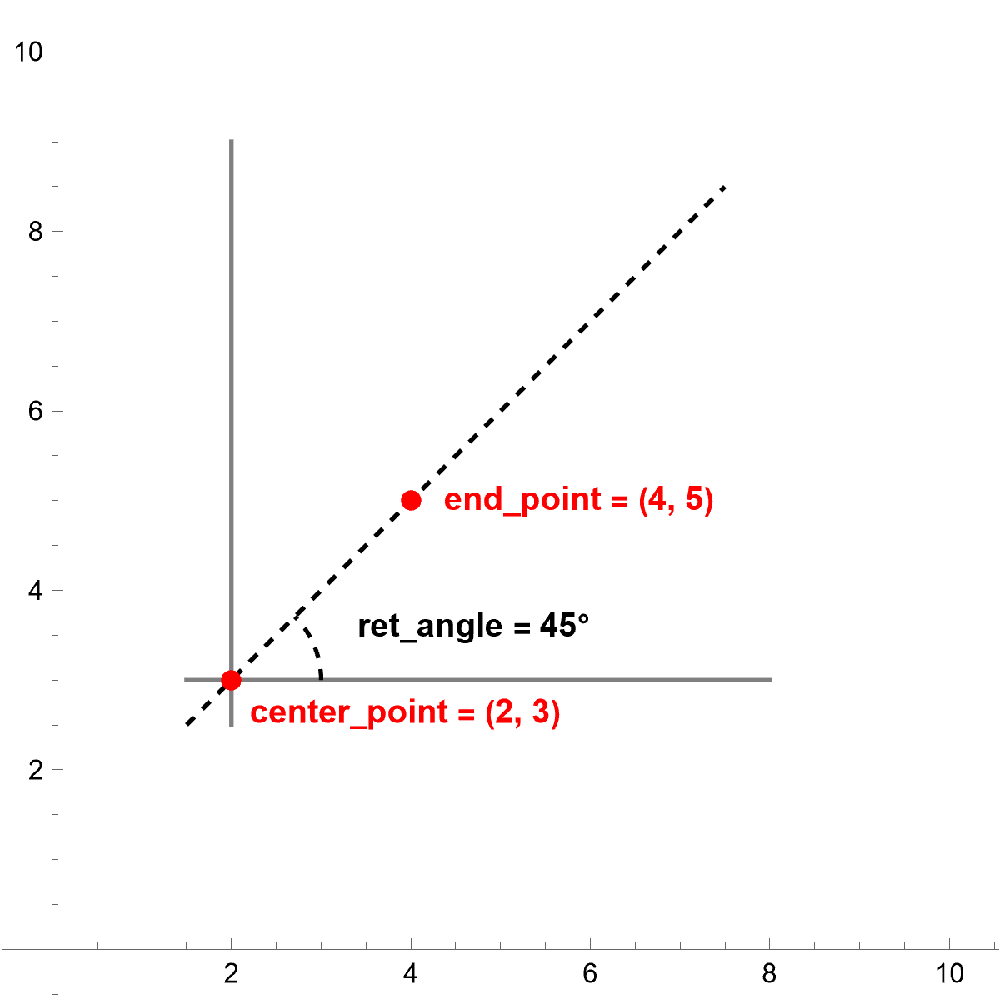
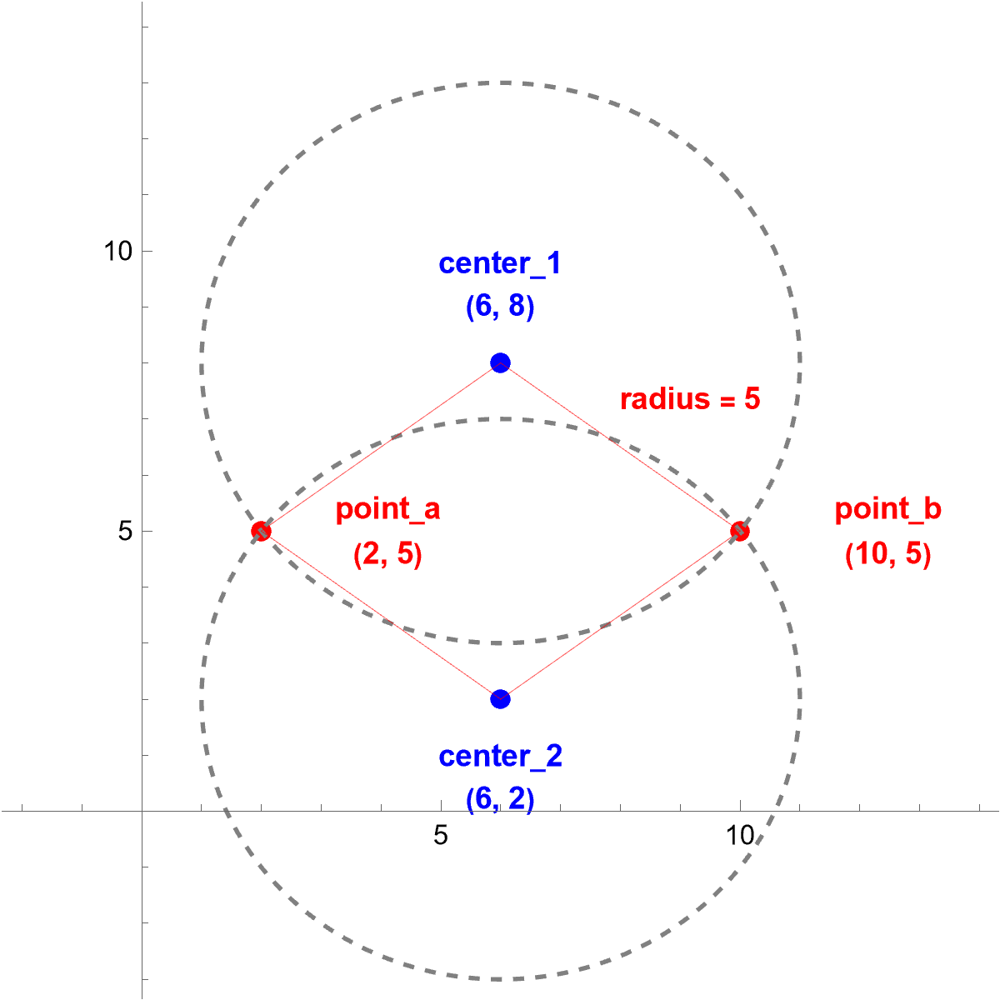

========================
misc_functions
========================

.. py:currentmodule:: gcodeBuddy.misc_functions

**************
angle Function
**************
.. autoclass:: gcodeBuddy.misc_functions.angle
    :members:

--------
Examples
--------

.. code-block:: python
    :caption: Basic Usage of angle()

    # imports angle function
    from gcodeBuddy import angle

    # creating necessary parameter points
    center_point = (2, 3)
    end_point = (4, 5)

    # returns 45.0
    ret_angle = angle(center_point, end_point)

    Visualization of angle() Example

****************************
centers_from_params Function
****************************

.. autoclass:: gcodeBuddy.misc_functions.centers_from_params
    :members:

--------
Examples
--------

.. code-block:: python
    :caption: Basic Usage of centers_from_params()

    # imports centers_from_params function
    from gcodeBuddy import centers_from_params

    # creating parameter variables
    point_a = (2, 5)
    point_b = (10, 5)
    radius = 5

    # returns (6.0, 8.0), (6.0, 2.0)
    center_1, center_2 = centers_from_params(point_a, point_b, radius)

    Visualization of centers_from_params() example

*********************
unit_convert Function
*********************

.. autoclass:: gcodeBuddy.misc_functions.unit_convert
    :members:

--------
Examples
--------

.. code-block:: python
    :caption: Basic Usage of unit_convert()

    # imports unit_convert()
    from gcodeBuddy import unit_convert

    # returns 10.0
    ret_val_1 = unit_convert(1, "cm", "mm")

    # returns 12.0
    ret_val_2 = unit_convert(1, "ft/sec", "in/sec")

    # returns 29.6359
    ret_val_3 = unit_convert(70, "in/min", "mm/sec")